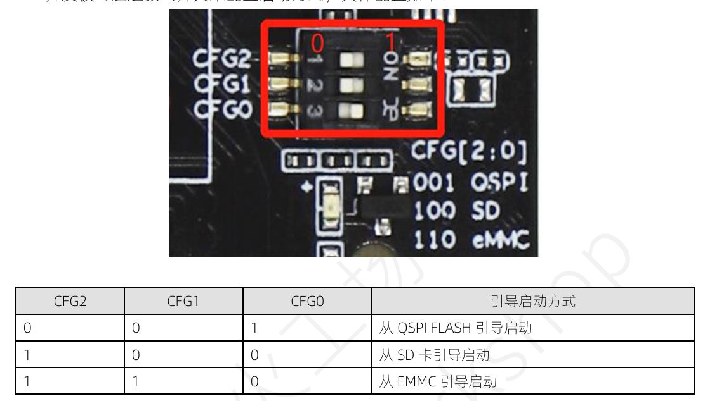
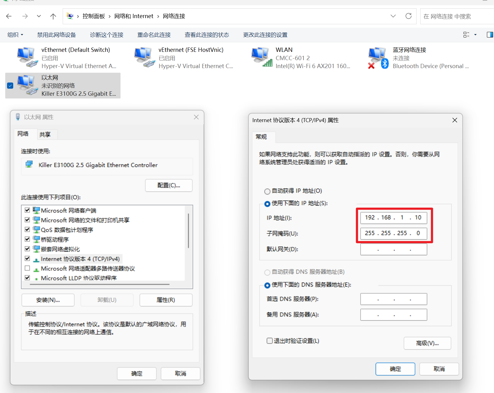
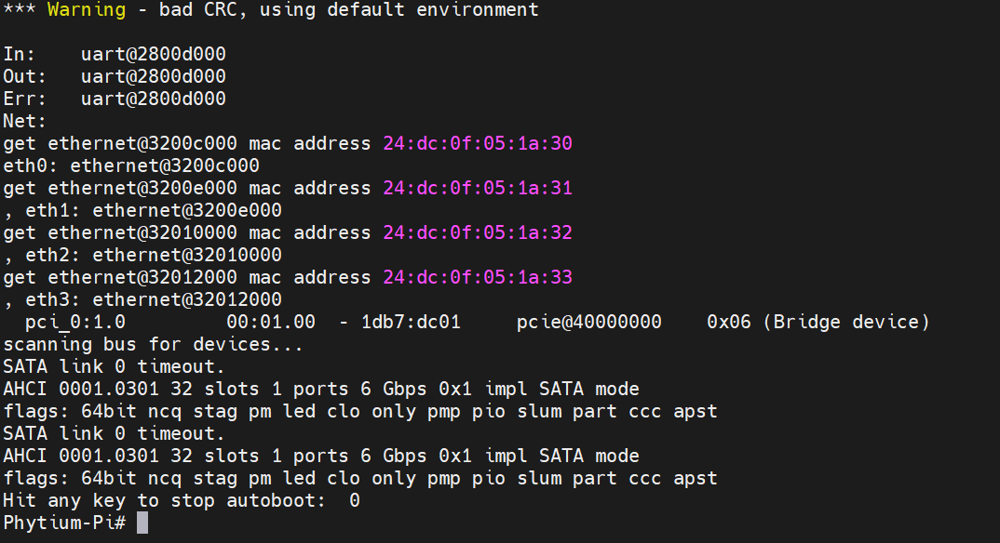
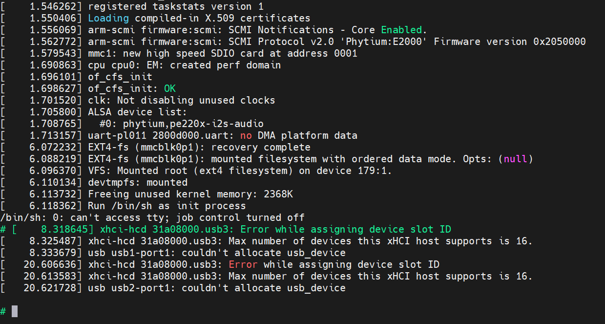
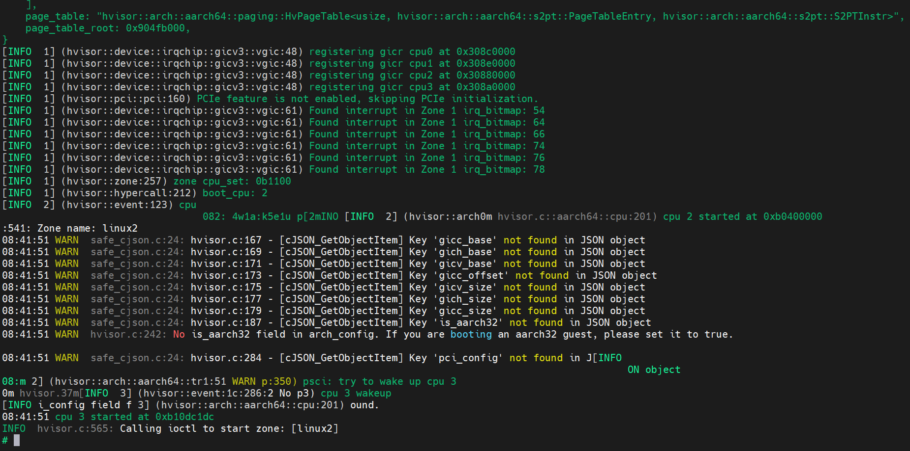

# 飞腾派SDK的获取

进入[ieasy cloud官网](https://www.iceasy.com/cloud/)，登录后选择飞腾派下载专区，依次选择`5-系统镜像->飞腾派V3版本ubuntu镜像 250422（最新）`进行下载。内核源码位于`4-系统源码`中。

准备好**USB转TTL串口线**（用于串口调试，串口线插入方式见飞腾派文档）、网线连接飞腾派与电脑、32GB的MicroSD卡并且使用win32diskimager烧录从官网下载的Ubuntu完整镜像（包含文件系统），拨码开关使用100让飞腾派从sd卡启动进入Ubuntu系统：


串口连接后，可通过MobaXterm软件进入调试窗口，选择新建Session->Serial。详细配置见飞腾派资料中的`2-用户开发手册`。

Ubuntu上Linux的最小镜像Image文件可通过[链接](https://pan.quark.cn/s/78ad8912edff?pwd=TBQd)下载，亦可以在进入飞腾派的Ubuntu系统上找到，镜像文件和设备树都位于Linux系统的`/boot`目录下。


# 编译 Hvisor 和设备树

1. 和其他开发板类似，拉取 hvisor 最新代码，仓库地址：https://github.com/syswonder/hvisor。进入目录后编译 hvisor：
    ```
    make BID=aarch64/phytium-pi LOG=info
    ```

    编译产生的文件位于`target/aarch64-unknown-none/debug/hvisor.bin`
2. 进入`platform/aarch64/phytium-pi/image/dts`目录，运行`make`对设备树进行编译，得到`phytium-pi-board-v2.dtb`、`linux1.dtb`、`linux2.dtb`。

# 制作文件系统

由于之前已经烧录到SD卡了，所以zone0的文件系统就是sd卡上之前烧录的文件系统，为了启动zone1还需要zone1-Linux的文件系统，有两种方式获取：

1.下载[文件系统](https://pan.quark.cn/s/78ad8912edff?pwd=TBQd)。
2.参考[基于ubuntu_base构建文件系统](https://foreveryolo.top/posts/60156/)自行制作文件系统。

# 通过 TFTP 启动 RootLinux
如果已经搭建了 TFTP 服务器，那么可以以方便的方式快速启动 RootLinux，具体而言：

1. 将 Image、linux1.dtb、hvisor.bin、phytium-pi-board-v2.dtb 复制到 ～/tftp 文件夹下
2. 用网线连接主机与开发板，配置主机ip为```192.168.1.10```，子网掩码```255.255.255.0```。
3. 直接开机并连接串口即可，uboot 将自动下载 tftp 文件夹下的内容并启动。

如果有搭建需求，可以参考[嵌入式平台快速开发-Tftp 服务器搭建与配置](https://foreveryolo.top/posts/17937/)。如果你是通过wsl的Ubuntu搭建TFTP服务器，通过网线与飞腾派开发板进行连接。由于WSL使用Windows的网卡配置，因此需要在Windows下修改以太网的ip地址，如果连不上可以试试关闭windows防火墙。


# 启动 Zone0-Linux
## 下载现成的配置文件
在飞腾派开发板上电后，快速连续敲击空格打断uboot启动：


## 执行启动命令
执行以下命令：
```shell
setenv serverip 192.168.1.10; setenv ipaddr 192.168.1.20; setenv loadaddr 0x90100000; setenv fdt_addr 0x90000000; setenv zone0_kernel_addr 0xa0400000; setenv zone0_fdt_addr 0xa0000000; tftp ${loadaddr} ${serverip}:hvisor.bin;
tftp ${fdt_addr} ${serverip}:phytium-pi-board-v2.dtb; tftp ${zone0_kernel_addr} ${serverip}:Image; tftp ${zone0_fdt_addr} ${serverip}:linux1.dtb; bootm ${loadaddr} - ${fdt_addr};
```


进入如下界面表示zone0 linux启动成功了：


# 启动Zone1-linux
## 编译 hvisor-tool

拉取 Hvisor-tool 的最新代码：https://github.com/syswonder/hvisor-tool/tree/main，进行编译：
```shell
make all ARCH=arm64 LOG=LOG_WARN KDIR=Phytium内核源码 VIRTIO_GPU=n ROOT=/path/to/target_rootfs
```
其中ROOT为Phytium根文件系统的路径，可以把之前下载的镜像mount到目录上。
更多细节请参考 hvisor-tool 的 Readme.md。编译结果位于`output/hvisor`和`output/hvisor.ko`。亦可在[网盘链接](https://pan.quark.cn/s/78ad8912edff?pwd=TBQd)里找到已经编译好的文件。

## 文件准备
在飞腾派的SD卡上的`/home/user/zone1`目录提前准备好如下文件（可以通过sd卡启动Linux，然后scp拷贝到该目录下：
1. hvisor、hvisor.ko
2. Image、linux2.dtb、rootfs2.ext4（zone1-Linux的文件系统）
3. zone1-linux.json、zone1-linux-virtio.json（位于hvisor项目的`platform/aarch64/phytium-pi/configs`目录）

## 执行启动命令
启动zone0-Linux后，在 `/home/user/zone1` 目录下执行下述命令（可以把这些命令统一写成`start.sh`然后直接执行该脚本）
```
chmod +777 hvisor
chmod +777 hvisor.ko

insmod hvisor.ko
rm nohup.out
mkdir -p /dev/pts
mount -t devpts devpts /dev/pts
mount -t proc proc /proc
mount -t sysfs sysfs /sys
nohup ./hvisor virtio start zone1-linux-virtio.json &
sleep 1
./hvisor zone start zone1-linux.json
```


依次执行如下命令，检查是否能成功进入zone1-Linux的终端
```shell
script /dev/null
screen /dev/pts/0
```
退出可按`ctrl+A`再按`K`键。
